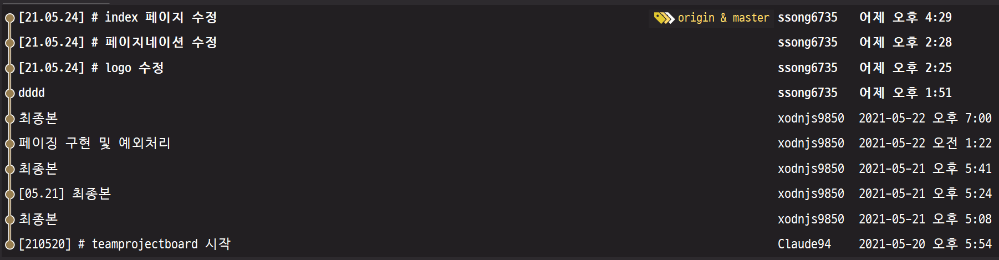
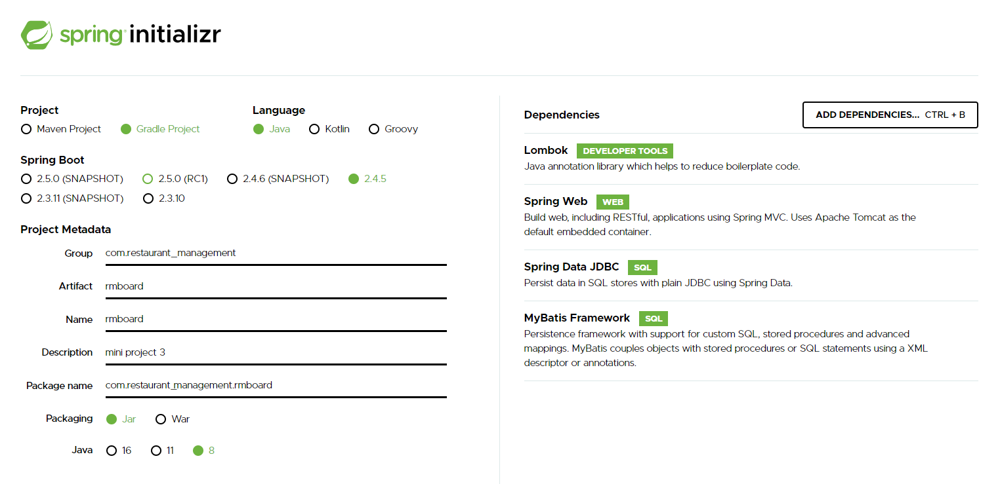

# 3차 팀 프로젝트 - 1조
- 팀장: 원동원, 팀원: 송미선, 김태원

- 프로젝트: 음식점 관리 시스템 개발


- 기존 작업 로그
  


## 스프링 서블릿 학습
- [스프링 프로젝트 설정 링크](http://start.spring.io)
- 

## 톰캣 포트 변경하기
- resources 폴더 밑에 application.properties 파일 수정
```groovy
# 웹서버 포트 변경
server.port = 8181
```